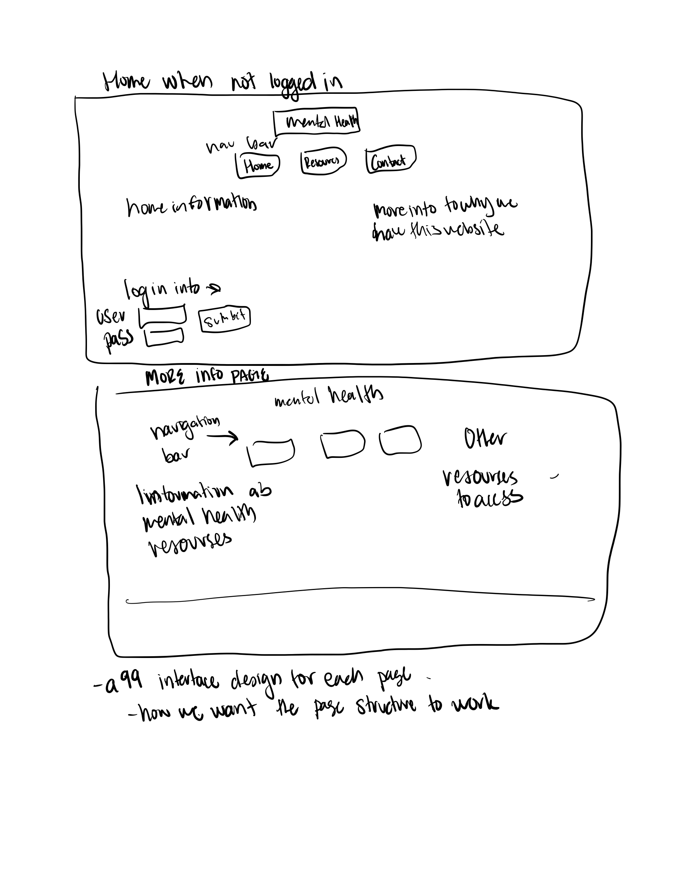
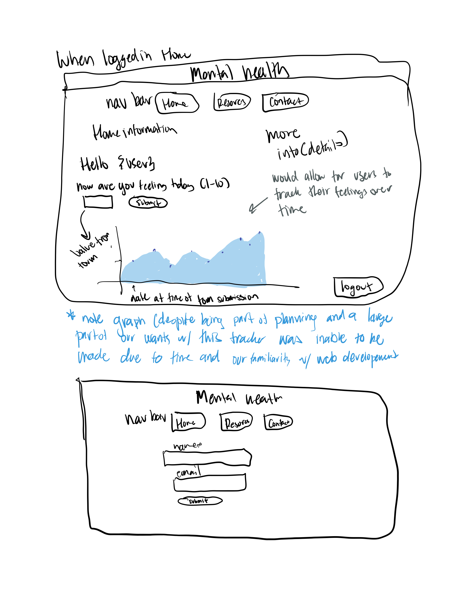

### Planning Documentation :

Throughout the process planning was done primarily through GroupMe, with very little on the github project plan. We would do in person meetings to discuss what we were going to work on until the next time we met and ask little questions within the GroupMe

## OVERALL GOAL OF THE PROJECT

For this project, we had the goal of having a homepage that would allow for a user to login and once logged in fill out a form that asked how they felt today (1-10). This form would display the data (user id feeling number and date at the time of form submission to a database). From the database we would select all the information and display a graph of the “feelings data”. This would allow people to check their mood over time and get a visualization of this. There will also be a contact page (where you could put your name and email into a database) and a More Resources page that shares different mental health resources. See images under April 12th for interface design and planning on the HTML side of things

## FINAL PROTOTYPE
Was able to create a login functionality/login database
Lacks contact us page as we didn’t create anything that would use the entries from it 
Unable to create a graph representation of the data within the developmental stage due to the amount of time it took us to make a functional login. Replacing this is a visualization via a google api which also allows access to logs on days chosen via a calendar, however!
More Resources was made and provides ample information
Can navigate through websites but not as much functionality as desired. 

* March 10th
    - Initial Meeting
    - Introductions primarily

* March 23rd
    - First planning meeting ; Decided “big idea” of final project
    - Decided to make a mental health website for tracking daily mental health and serving as a collection of mental health resources (Moodpanda was inspiration) https://moodpanda.com/ 

* March 30th
    - Meeting with Osemudiamen Izokun (our TA)
    - Ran final project idea by him and he gave it the all clear

* April 12th
    - Second planning meeting ; 
        - Created mock-up of website on powerpoint slides to aid front-end development seen below (Blue has notes from development phase)
        - 
        - 
    - Agreed to review class concepts relevant to the final project and to work on clearing out our schedules of papers and projects to be able to prioritize the project in the last two weeks of classes

* April 19th
    - Third planning meeting ; 
        - Decided on tasks to get started on the final project coding
    - Sadye agreed to meet with Osemudiamen Izokun for database help on April 20th ; a topic all of us have been trying to think of how to implement into the project
    - Albert agreed to consolidate notes on previous meetings into this document ; 
    - Also agreed to look into React and data input by users to be stored into a database. Will create some endpoints if he has the time before the next meeting.
    - Janet agreed to start consolidating mental health resources to suggest on the website
    - Meghana agreed to start making the HTML and CSS webpages which will correspond to the endpoints
    - Agreed to meeting on April 21st as a “check-in” and to divvy out more work

* April 21st
    - Meeting was unanimously rescheduled to April 22nd

* April 22nd 
    - Meghana showcased the webpages she made
    - Albert and Sadye agreed to work on the database and corresponding personal user info webpage based on tools studied between meetings
    - Janet agreed to linking the remaining resources to the resource.html page and adding to the existing research document.

* 4/30/2022
    - Met up in library for “mega project day”
    - Met in office hours with professor Martin twice
    - Continued to work through day until done
    - Finalizing login pages 
    - Below is information we received from going to office hours to help w finalization
    - https://masteringjs.io/tutorials/express/redirect
    - https://www.section.io/engineering-education/session-management-in-nodejs-using-expressjs-and-express-session/

* 5/1/2022
    - Polished a little further, removing redundant contact us webpage
    - Created api documentation
    - Created demo
    - Edited aesthetics
    - Made final commit!!!
